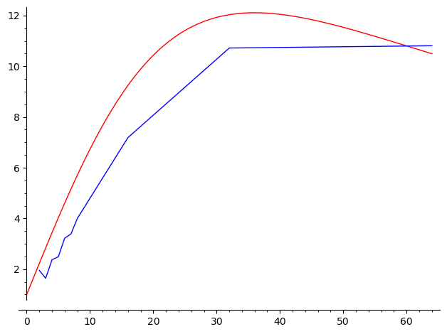

# CSE-曹翰林-U202111172

[repository link:](https://github.com/F1shAndCat/asst1 "github link")

# T1

## 1

OK.The Code is in the F1shAndCat branch

## 2

$x$ is the Threads count .

$f(x)=\frac{cx}{ax^2+cx+b}=\frac{x}{a^{'}x^2+x+b^{'}}$

$cx$ is the boosting factor when $ax^2+b$ is the switchings between threads' factor since we ignore the joining time waste because the Threads' expected running time is the same.

The function actually comes from a conjugation that the accelerate rate will increase first and decreases last.Thus this is maybe a inverse Hook function.

$f(x)=1+\frac{800*x}{x^2+1296}$

Not Linear.The acceleration depends on the difference between the bus rate and the processing code's clock counts.So when there are sufficiently many threads,the pipelining will be diffused and it may get slower due to the thread managing.

Futhurmore,we noticed that the 2-pows sometimes runs better than the ones with more Threads but not in 2-pows pattern.Guess that this is because the blocks are not attributed evenly in each threads regarding the flooring division ,or because the processors' structure is built in 2 pows.

## (UPD)3.

* 2Threads:(1.95x speedup from 2 threads)
* 3Threads:(1.64x speedup from 3 threads)
* 4Threads:(2.37x speedup from 4 threads)
* 5Threads:(2.49x speedup from 5 threads)
* 6Threads:(3.22x speedup from 6 threads)
* 7Threads:(3.39x speedup from 7 threads)
* 8Threads:(4.00x speedup from 8 threads)
* 16Threads:(7.19x speedup from 16 threads)
* 32Threads:(10.72x speedup from 32 threads)

  * Discovered changing little after switching to the given method

## 4

Attribute blocks based on columns dividing for each Thread to process to obtain speedup,while omiting the mutiplication code since it can be substituded by addition with fewer clock cycles consumed.

## 5

As above in #3,16 threads has 7.19x speedup performance.It DOES have a noticably greater performance than that of 8 threads.This is because for my PC's CPU is AMD Ryzen 7 4800H which has  8 cores,with hyper-threads it has 16 threads, thus it runs well in 16threads,and even in 32 threads because the thread managing cost is less than the pipling speedup.(BTW,The speedup rate congverges to 11x at 64 threads, with about 10.8x speedup)

## EXTRA

I've been trapped by the float number for a long time because I've been trying to imple my own Thread Version, changing all the multiplication in thread to addition due to waiting times. I've conjectured that the float error may be big.But I'd just found another problem,that i used interger dividing  and float dividing at the same time,which will leads to a distortion though we can barely tell.That's why i continued to find the next version.I changed all dividing to interfer dividing and United the Steplength to make each number be at a same standard and it will definitely has no distortion. But it still didn't follow the Serial Method. Finally I changed my addition to multiplication ,and the iterations at the bright-dark border diverge from the former significantly.(From 256 to 50!)Now it turns out obviously that it's due to the FloatError.

Had no choice but impled the Given Method,and it works at place.The speedup also change little.this is really annoying. Maybe the pipeling diffused the latency? Trying to optimize a thing that maybe already fully optimized,that's what we often do.But when our investment pays,it satisfy me.

# T2

## 1

OK Done.

## 2

| `VECTOR_WIDTH` | vector utilization |
| -------------- | ------------------ |
| 2              | 79.0%              |
| 4              | 72.0%              |
| 8              | 68.3%              |
| 16             | 66.6%              |

Obviously the vector utilization decrease as ``VECTOR_WIDTH`` changes.

That's because that the calculating times depends on the greatest exponents in chosen vector,namely each elements will have a cost same as the greatest exponent in its vector.So when the ``VECTOR_WIDTH`` is chosen greater,more small exponent vectors will be merged in to a big one and lifts its unutilized vector lanes.

And that's exactly why the the vector utilization decrease as ``VECTOR_WIDTH`` changes.

## 3

OK Done. A double-the-sum inplementation should be fine.

this is like:

($N=8 $ and I use bars to divide the vector elements)

$0|1|2|3|4|5|6|7$

$01|23|45|67|01|23|45|67$

$\dots$

When the while ends,the vector has:

$0\dots7|0\dots7|\dots|0\dots7$

Then letting the sum be a.value[0] is OK.

# T3

## 1

maximum speedup should be 8x because the vector instruction is 8-wide.

That might because transfering the float number type to the the type that  AVX2 vector instructions can process will cost time.

And Do 32*8-bits multiple itself will cost more clock cycles than Do 32 bits

mutiple.

## 2

### .1

10.9x speedup.

that is about 1.9x from 10.9x/5.72x

### .2

I determine to create 32 or 64 tasks,because the multithreading works best in 32 or 64 -threads in the first proggraming.

Actually,64 thread runs best.

And the SIMD vectorizing optimization is different from multithreadings, that is to exploit CPU's structure,rather than pipling which overcomes the speed difference between processing speed and bus speed.So the speedup will be that two optimization's mutiple.

## .3

The difference is that std::thread directly use the kernel threads,but ISPC use virtual threads.this is to say that acutally ISPC uses process to imple the thread's mission. Use process will cost more management resources but can exceed the thread limit.

# T4

## 1

SIMD speedup is about 5x.

multi-core parallelization speedup is about 10x.

## 2

Making all the elements' calculation in vector more complicated will increase the SIMD effciency.

Making each function's processing time longer,namely the Iterations until convergence  will increase the degree SIMD's efficiency increases.

Thus let all the elements in the array to be 2.999(not 3 because 3 will not converge),this will make the SIMD speedup come to about 7.2x,and total speedup at about 75x.

This doesn't increase multi-core parallelization speedup since the calculating instructions aren't changed.So there's no difference in the pipeling efficency ,thus multi-core parallelization speedup stays the same.

## 3

Against .2,there're enough reasons for us to choose a number that mimize the calculation complexity. Constuct all 1's satisfy the condition.

the relative performance is about 1.5x.because the cauculation will barely cost time.So the complexity will come mainly from the iteration and condition

clause ,which vectorization will do little help.

## 4

Done.Added it to the excutables and the source code.

there's a trivial but usal buffle that the absolute of float number is different from that of intergers.That sounds obvious but I'd been trapped here for a long time.

You should just bitand is highest bit to zero.That's enough,despite for interger when it's negative we should also flip other bits and plus 1.(also can be treated as module 2^32/64 subtraction,but that comes more directly).

# T5

## 1

The speedup is very trivial,below 1,1x.

As it says above,the saxpy's mission is to only compute merely one time.It means that it's a I/O heavy code rather than a computation heavy code.

That means both the influence using vectorization optimization and the influence using multicore parallelization will pay little help,and since the calculation optimization is already diffused by vectorization,the multicore parallelization will see bare optimization.

No.Now the CPU's processing speed is actually faster than the bus speed.So the total speed depends on the bus speed.Then we can't do a multicore parallelization which is a cpu speedup method,to improve the bus speed bottleneck.

However,we can change the iterating method,but that will make the iterating method between ispc and ispc method difference,stands that optimization doesn't comes from multicore parallelization.

jutification:

changing thread numbers won't change the speedup.

adding computation instructions will explicitly increase the speedup.

## 2

Because in order to make the CPU cache and Memory data  syncronize,when writing over a memory unit,CPU will find in its'  cache,if the memory unit is hit,that's ok,CPU only need to change the data in cache and write it back to memory.But when cache miss appears,CPU had to find the memory unit and put the data into its cache,no matter whether it will use the data or not.

So the bandwidth in total is $4Nbytes$ ,`result`  2times ,X 1time and Y 1time.

## 3

We can reduce the iteration/calculation ratio to speedup the IO rate.

*Thus we can directly use loop unrollng to accelerate.*

*If we're in C++ main we can use #pragma GCC 'unroll-loop' to reduce the iteration/calculation ratio,but we're in ISPC,So we can just chose a reasonable number and unroll it manually. (Ignore this)*

\* Just Found out that ISPC has optimizied the iteration because the bandwith dereased when i used `programcount` coding way.So we can only turn to the cpu cache since we we found that if cache hit the bandwidth will increase significantly.(Actually this helps me solve #2 because when i'm coding #3 I found that cache hit significantly increase the bandwidth)

 After solving #2 ,we've known from #2 that there is actually a toxic memory access,namely the `result` memory reading.So I try to avoid that access,

and it turns out that it runs well, there is about 33% increase in speed,which is in our expectation.

And by the way ISPC code seems to have no api access to directy change the memory unit,So I Used AVX/AVX2 code to imple it.And remember to use `align_alloc` to distribute the memory as it will get a `Segment Fault` verdict when the float array isn't well aligned when using `_mm256_stream_ps`.
